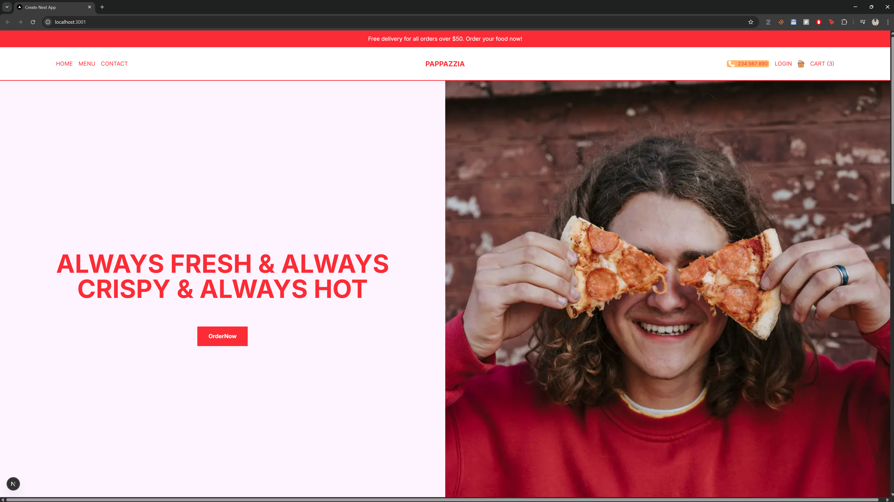
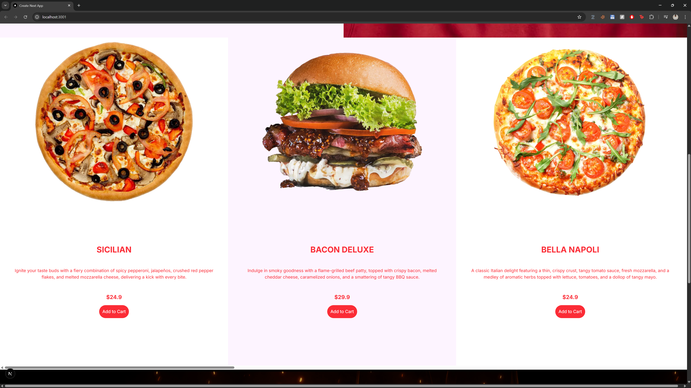
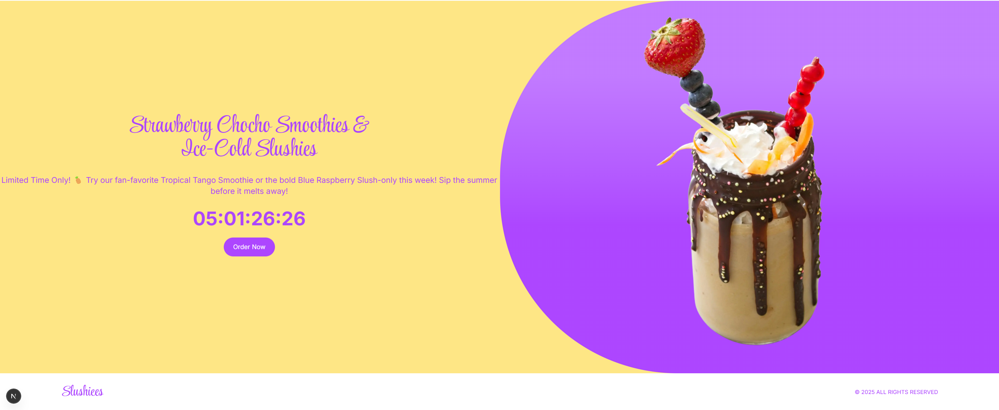

## 🥤 Slushiees Web App

Welcome to the Slushiees Web App — a vibrant, responsive ordering interface for a fictional drinks shop, crafted using the power of Next.js.
Open http://[slushiees.com](https://slushiees-web-app.vercel.app/) in your browser to explore the project.

## 🛠️ Tech Stack

- Frontend Framework: Next.js

- Styling: Tailwind CSS

- Animations & Effects: react-countdown, dynamic imports. tailwind animations

- Deployment: Vercel

- Icons & Assets: Custom illustrations and product images

## 📦 Features

- 🥤 Dynamic Menu: Smoothies, slushies, and shakes organized by category and routed via slugs (e.g., /menu/smoothies)

- ⏳ Countdown Offer: Limited-time drink deals using react-countdown

- 📱 Fully Responsive UI: Optimized for seamless experience on any device

- 🔐 Login UI: Simple, elegant login interface with mock third-party login buttons

- 🧃 Category Cards: Scrollable, vibrant drink sections with hover animations

- 🧭 Client-Side Routing: Fast and fluid page transitions with Next.js

## 🚀 Getting Started

To run the app locally:

```
# Clone the repo
git clone https://github.com/arboydev27/slushiees-web-app.git

# Navigate to the project folder
cd slushiees-web-app

# Install dependencies
yarn install

# Run the development server
npm run dev

# Open http://localhost:3000 in your browser

```

📸 Preview




## 🧠 Notes

This project is built with modern web dev practices in mind and is structured for easy extension — perfect for adding:

- A backend for order processing

- A cart system

- A checkout page

- Or CMS-based content management
