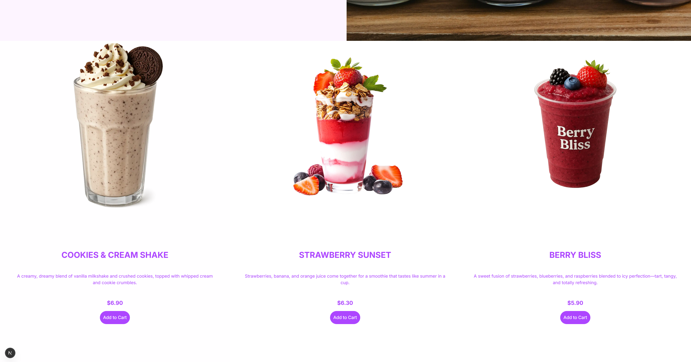

## 🍕 Pizza Restaurant App

Welcome to the Pizza Restaurant Web App — a sleek, responsive ordering interface for a fictional pizza restaurant, built with the powerful features of Next.js. Learned most of the stuff from a Youtube Channel.
Open [http://pizzarestaurant.vercel.app](https://pizza-restaurant-app-b3mb.vercel.app/) with your browser to view the project.

## 🛠️ Tech Stack

- Frontend Framework: Next.js

- Styling: Tailwind CSS

- Animations & Effects: react-countdown, dynamic imports

- Deployment: Vercel

- Icons & Assets: Custom images and icons for menu and login experiences

## 📦 Features

- 🍕 Dynamic Menu: Each pizza category is clickable and routed dynamically via slugs (e.g., /menu/margherita)

- 🧾 Countdown Offer: Limited-time deals powered by react-countdown

- 📱 Fully Responsive UI: Optimized for both mobile and desktop

- 🔐 Login UI: Clean authentication interface with third-party login buttons (Google & Facebook mock)

- 🎨 Category Cards: Vibrant, scrollable menu sections with background images and hover effects

- 🧭 Client-Side Routing: Seamless transitions using Next.js <Link />

## 🚀 Getting Started

To run the app locally:

```
# Clone the repo
git clone https://github.com/arboydev27/pizza_restaurant_app.git

# Navigate to the project folder
cd pizza-restaurant-app

# Install dependencies
yarn install

# Run the dev server
npm run dev

# Open http://localhost:3000 in your browser

```

📸 Preview



## 🧠 Notes

This project is built with modern web dev practices in mind and is structured for easy extension — perfect for adding:

- A backend for order processing

- A cart system

- A checkout page

- Or CMS-based content management
